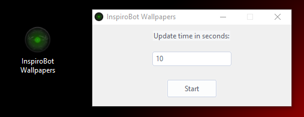
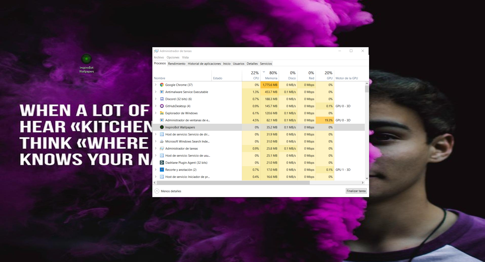

# InspiroBot Wallpapers
Changes your wallpaper every given amount of time in seconds for a nice inspirobot.me quote.

This is how it works:

1.Input a time in seconds, ex: 10 (if you want to add time in minutes or hours you'll have to calculate it yourself).

2.Click start

3.Enjoy your soul getting eaten

### Examples

### How to close
There is only one way... but i'll surely change it someday

